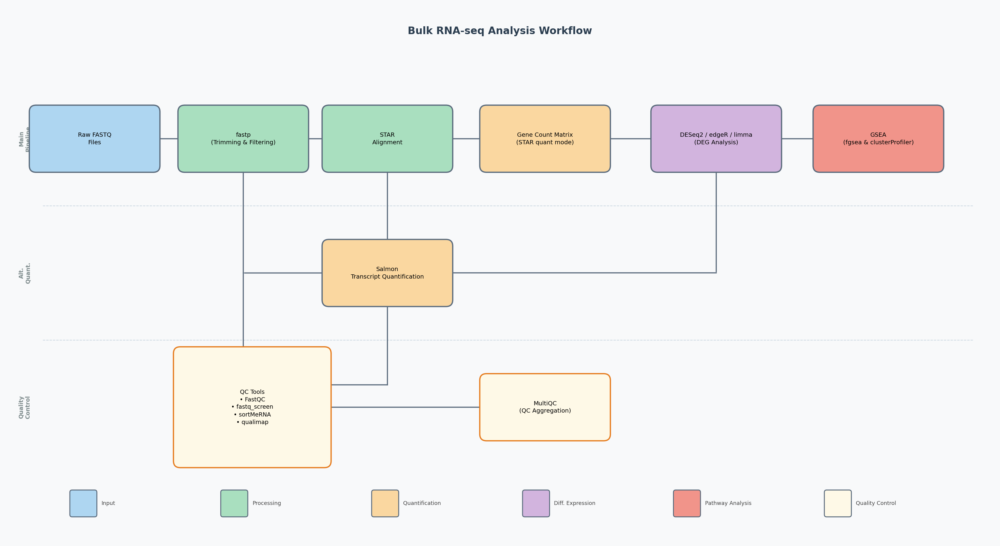

# bulkRNAseq pipeline for MSAR core at CCF
The pipeline is inspired by the bulkRNAseq pipeline from the bioinformatics and biostatistics core at Van Andel Institute.
## Overview of the workflow



1. Create a samplesheet file to execute the pipeline. It should be a `csv` file following the format below:

| sample  | fq1                 | fq2                 |
| ------- | ------------------- | ------------------- |
| sampleA | sampleA_R1.fastq.gz | sampleA_R2.fastq.gz |

2. Execute the pipeline. The following steps/tools will be executed:
   1. `fastqc` on each sample — raw fastq files
   2. `fastp` to trim adapter sequences and low-quality reads
      - Options used:
        - `--trim_front1 1` / `--trim_front2 1` (trims 1 base from the 5' end of reads)
   3. `seqtk` to subsample 100,000 reads per sample for screening
   4. `fastq_screen` on subsampled R1 reads to detect possible contaminants
   5. `sortMeRNA` on subsampled reads for rRNA detection
   6. `STAR` for reads alignment with `--quantMode GeneCounts` to generate a raw gene count matrix
   7. `samtools` to index aligned BAM files
   8. `qualimap` for RNA-seq QC metrics and gene body coverage
   9. `featureCounts` for read counting per gene
   10. `gene_count_mat` to compile STAR gene counts into a matrix
   11. `gene_id_to_gene_symbol` to annotate gene IDs with gene symbols
   12. `multiqc` to summarize output from all QC tools
3. Optional steps (configurable in `run.config`):
   - `Ribodetector` — rRNA removal from trimmed reads before alignment
   - `Salmon` — transcript-level quantification
   - `TPMCalculator` — TPM value calculation

## How to execute the pipeline
Adjust the configuration files such as `bulk_rnaseq_conf/run.config` and `cluster.config`. After that,
```
sbatch run_bulk_rnaseq.slurm
```

## Configuration

- cluster configuration → `cluster.config`
- location of reference genome → `reference.config`, used by `STAR` and `Salmon`
- singularity image file path → `processes.config`
- `run.config` — location of samplesheet; toggle `Ribodetector` for rRNA removal, `Salmon`, and `TPMCalculator`

## Miscellaneous

strand info: try https://github.com/signalbash/how_are_we_stranded_here

https://github.com/igordot/genomics/blob/master/notes/rna-seq-strand.md

reverse strand for Illumina TruSeq Stranded Total RNA

https://dbrg77.wordpress.com/2015/03/20/library-type-option-in-the-tuxedo-suite/
