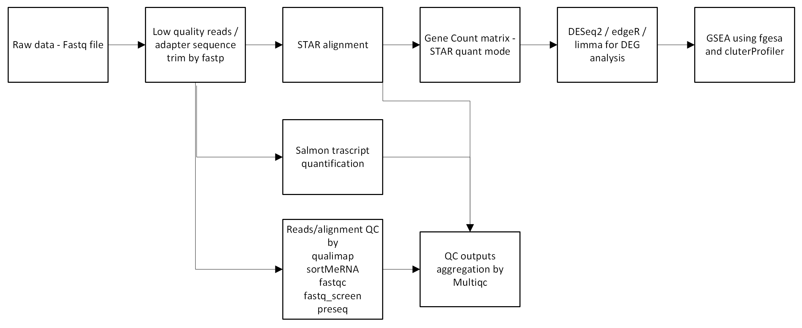

# bulkRNAseq pipeline for MSAR core at CCF
The pipeline is inspired by bulkRNAseq pipeline from bioinformatics and biostatistics core at Van andel institute.
## Overview of the workflow



1. Create a samplesheet file to execute the pipeline which should be a `csv` file following the format below:

| sample  | fq1                 | fq2                 |
| ------- | ------------------- | ------------------- |
| sampleA | sampleA_R1.fastq.gz | sampleA_R2.fastq.gz |

2. Execute the pipeline. Following steps/tools will be executed.
   1. `fastqc` on each sample - raw fastq files
   2. `fastp` to trim adapter sequences and low quality reads
      1. below options used for `fastp`
         - `--qualified_quality_phred 20`
         - `--adapter_fasta $adapter`
   3. `fastq_screen` on R1 fastq files to detect possible contaminants.
   4. `preseq` for library complexity
   5. `qualimap` for gene body coverage plot
   6. `sortMeRNA` for rRNA detection
3. `multiqc` for summarizing the output files of the qc tools
4. Reads alignment using `STAR` with `quantMode GeneCounts` option to generate a gene count matrix
5. Transcription quantification using `Salmon`

## How to execute the pipeline
Adjust the configuration files such as `bulk_rnaseq_conf/run.config and cluster.config`. After that,
```
sbatch run_bulk_rnaseq.slurm
```

## Configuration

- clustter configuration -> `cluster.config`
- location of reference genome -> `reference.config`, `STAR` and `salmon` used.
- singularity image file path -> `processes.config`
- `run.config` for location of samplesheet and turn on/off `Ribodetector` for rRNA removal, `salmon` and `tpm calculator`

## Miscellaneous

strand info: try https://github.com/signalbash/how_are_we_stranded_here

https://github.com/igordot/genomics/blob/master/notes/rna-seq-strand.md

reverse strand for Illumina TruSeq Stranded Total RNA

https://dbrg77.wordpress.com/2015/03/20/library-type-option-in-the-tuxedo-suite/